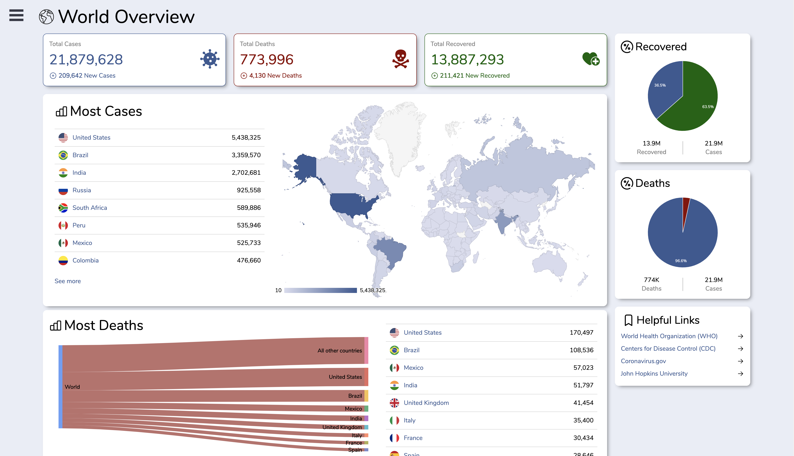
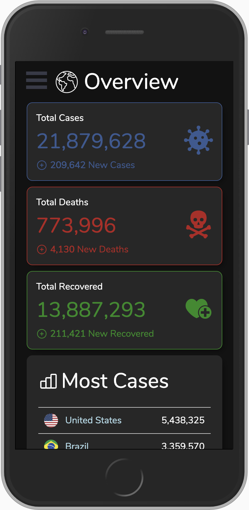

# COVID-19 Tracker 2.0

Visualize the rate of infection and spread of the 2019 novel coronavirus (COVID-19).

Check out version 1.0 [here](https://github.com/andyrutherford/covid19-tracker).

## Features

- See the most recent data in a visually optimized format.
- Enable dark mode. Theme settings are saved in local storage.
- Fully responsive and mobile friendly.




## Setup

To clone and run this application, you'll need [Git](https://git-scm.com/) and [Node.js](https://nodejs.org/) (which comes with [npm](https://www.npmjs.com/)) installed on your computer. From your command line:

```sh
# Clone this repository
$ git clone https://github.com/andyrutherford/covid2.0.git

# Go into the repository
$ cd covid2.0

# The geomap requires a google maps api key.
# Create a .env in the root of the project with your api key:
$ REACT_APP_GOOGLE_MAPS_API_KEY=<your-google-maps-api-key>

# Install dependencies
$ npm install

# Run the app
$ npm start
```

## Tech

COVID19-Tracker uses a number of open source projects to work properly:

- [ReactJS](https://reactjs.org/) - A JavaScript library for building user interfaces
- [axios](https://github.com/axios/axios) - Promise based HTTP client for the browser and node.js
- [styled components](https://styled-components.com/) - for styled components
- [React Google Charts](https://react-google-charts.com/) - for integrating Google Charts into React
- [COVID19 API](https://covid19api.com/) - for data on COVID-19

## Demo

https://covid-dashboard2.netlify.app/

## License

MIT
